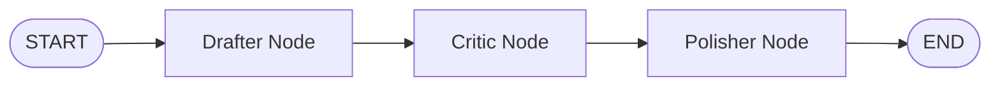
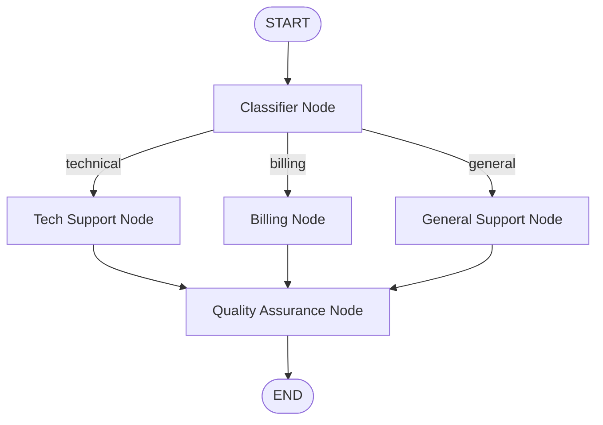
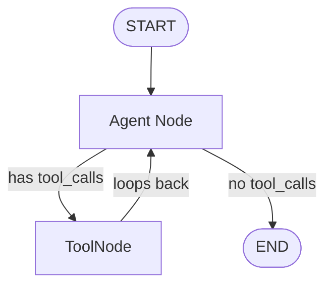
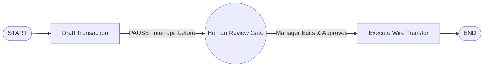

# 🚀 LangGraph Deep Dive & Hands-On Tutorial with Groq

A complete, production-ready tutorial project designed to help you understand **all core concepts of LangGraph** through clean, runnable Python code with concise, pedagogical explanations.

Powered by **Groq** high-speed inference.

---

## 📚 Table of Contents
1. [Core Concepts Overview](#-core-concepts-overview)
2. [Project Structure](#-project-structure)
3. [Quickstart Setup](#-quickstart-setup)
4. [Concept Breakdown & Lessons](#-concept-breakdown--lessons)
   - [Lesson 1: State, Nodes, Edges & Reducers](#lesson-1-state-nodes-edges--reducers)
   - [Lesson 2: Conditional Edges & Routing](#lesson-2-conditional-edges--routing)
   - [Lesson 3: ReAct Cyclical Agents & Tools](#lesson-3-react-cyclical-agents--tools)
   - [Lesson 4: Memory Checkpointing & Threads](#lesson-4-memory-checkpointing--threads)
   - [Lesson 5: Human-in-the-Loop & Breakpoints](#lesson-5-human-in-the-loop--breakpoints)
   - [Lesson 6: Streaming Modes & Time Travel](#lesson-6-streaming-modes--time-travel)
5. [Interactive Application](#-interactive-application)

---

## 🧠 Core Concepts Overview

| Concept | What It Is | Why It Matters |
| :--- | :--- | :--- |
| **`StateGraph`** | The blueprint container for your workflow. | Encapsulates the graph topology, state schema, and execution rules. |
| **`State`** | A shared dictionary or `TypedDict` passed to every node. | Acts as the single source of truth across steps. |
| **Reducers** | Functions specifying how state updates merge (e.g. `add_messages`, `operator.add`). | Prevents overwriting list history; allows appending or custom delta merges. |
| **Nodes** | Plain Python functions: `(state: State) -> dict`. | Performs computations, calls LLMs, or executes business logic. |
| **Edges** | Direct connections: `builder.add_edge(source, dest)`. | Defines deterministic control flow from one step to the next. |
| **Conditional Edges** | Dynamic branching: `builder.add_conditional_edges(...)`. | Routes to different nodes at runtime based on LLM decisions or state values. |
| **`START` / `END`** | Virtual nodes marking entry and exit points. | Provides explicit graph boundaries. |
| **Cycles (Loops)** | Edges pointing backward (e.g. `tools -> agent`). | Enables ReAct patterns where agents reason, use tools, and inspect outputs repeatedly. |
| **`Checkpointer`** | Persistent snapshot engine (`MemorySaver`, `SqliteSaver`). | Enables multi-turn conversational memory, pauses, resumes, and state audits. |
| **`thread_id`** | Unique session identifier passed in config. | Isolates conversation history and checkpoints between different users. |
| **Breakpoints (HITL)** | Pauses before or after specified nodes (`interrupt_before`). | Enforces human approval or edits before sensitive or irreversible actions. |
| **Streaming** | Emitting outputs as they occur (`updates`, `messages`). | Real-time UX for UIs and terminals (low latency). |
| **Time Travel** | Replaying or branching from past checkpoints. | Debugging, auditing, and "what-if" scenario exploration. |

---

## 📂 Project Structure

```text
Langraph/
├── .env                              # Groq API key and model configuration
├── requirements.txt                  # Python dependencies (langgraph, langchain-groq, etc.)
├── config.py                         # Centralized LLM factory with auto-model resolution
├── main.py                           # Interactive CLI launcher, test runner & chat agent
├── 01_basics_state_and_nodes.py      # Lesson 1: State, Nodes, Edges, Reducers
├── 02_conditional_routing.py         # Lesson 2: Dynamic branching & routers
├── 03_react_agent_with_tools.py      # Lesson 3: ToolNode, ReAct loops & cycles
├── 04_persistence_and_memory.py      # Lesson 4: Checkpointers, Threads & State isolation
├── 05_human_in_the_loop.py           # Lesson 5: Breakpoints, Approval gates & State editing
└── 06_streaming_and_time_travel.py   # Lesson 6: Streaming (updates/tokens) & Checkpoint rewind
```

---

## ⚙️ Quickstart Setup

### 1. Environment Configuration
The `.env` file contains your Groq credentials:
```env
GROQ_API_KEY=gsk_...
GROQ_MODEL=llama-3.3-70b-versatile
```
*(Note: If `llama-3.3-70b-versatile` is not accessible on your API key tier, `config.py` automatically detects this and falls back seamlessly to an active high-performance model such as `openai/gpt-oss-120b`).*

### 2. Install Dependencies
```bash
pip install -r requirements.txt
```

### 3. Run the Interactive Launcher
```bash
python main.py
```

---

## 🔬 Concept Breakdown & Lessons

### Lesson 1: State, Nodes, Edges & Reducers
*File: `01_basics_state_and_nodes.py`*

Demonstrates a sequential 3-step publishing pipeline:

- **State Definition**: Uses `TypedDict` to declare fields (`topic`, `draft`, `critique`, `final_essay`).
- **Reducer**: Uses `Annotated[List[str], operator.add]` so that node executions append to `step_history` instead of overwriting it.

```bash
python 01_basics_state_and_nodes.py
```

---

### Lesson 2: Conditional Edges & Routing
*File: `02_conditional_routing.py`*

Demonstrates dynamic intent classification and conditional routing:

- **Conditional Edge**: `builder.add_conditional_edges("classifier", route_ticket, path_map)`
- **Router Function**: A pure Python function that inspects `state["category"]` and determines the target node name.

```bash
python 02_conditional_routing.py
```

---

### Lesson 3: ReAct Cyclical Agents & Tools
*File: `03_react_agent_with_tools.py`*

Demonstrates how LangGraph handles **loops / cycles** to create reasoning agents with tools:

- **`@tool` Decorator**: Defines callable tools (`calculate_expression`, `lookup_product_stock`).
- **`llm.bind_tools(tools)`**: Passes tool schemas to Groq LLM.
- **`ToolNode` & `tools_condition`**: Built-in LangGraph helpers that execute tools and check if the agent requested a tool.
- **Cycle**: An edge from `tools` back to `agent` completes the feedback loop.

```bash
python 03_react_agent_with_tools.py
```

---

### Lesson 4: Memory Checkpointing & Threads
*File: `04_persistence_and_memory.py`*

Demonstrates state persistence across user conversation turns:
- **`MemorySaver()`**: Automatically serializes state into an in-memory database after every step.
- **`thread_id`**: Config key that identifies the user's thread (`{"configurable": {"thread_id": "alice-1"}}`).
- **Thread Isolation**: Ensures Alice's conversation context never leaks into Bob's conversation.
- **State Inspection**: `graph.get_state(config)` and `graph.get_state_history(config)`.

```bash
python 04_persistence_and_memory.py
```

---

### Lesson 5: Human-in-the-Loop & Breakpoints
*File: `05_human_in_the_loop.py`*

Demonstrates safe execution of high-stakes workflows:

- **`interrupt_before=["execute_transaction"]`**: Pauses graph execution before running the sensitive node.
- **`graph.update_state(...)`**: Allows human supervisors to review, adjust transfer amounts, or reject actions before resuming.
- **`graph.invoke(None, config)`**: Resumes the workflow directly from the paused breakpoint.

```bash
python 05_human_in_the_loop.py
```

---

### Lesson 6: Streaming Modes & Time Travel
*File: `06_streaming_and_time_travel.py`*

Demonstrates real-time output and historical checkpoint replay:
- **`stream_mode="updates"`**: Emits state deltas as soon as each node finishes.
- **`stream_mode="messages"`**: Emits tokens live from the Groq LLM chunk by chunk.
- **Time Travel**: Inspecting historical checkpoints, rewinding back to a previous state, modifying values, and branching into an alternative timeline.

```bash
python 06_streaming_and_time_travel.py
```

---

## 💬 Interactive Application

Run `python main.py` to access the full menu:
```text
======================================================================
          LANGGRAPH COMPREHENSIVE LEARNING SUITE
   Provider: Groq | Active Model: openai/gpt-oss-120b
======================================================================
 [1] Lesson 1: State, Nodes, Edges, and Reducers
 [2] Lesson 2: Conditional Edges & Dynamic Routing
 [3] Lesson 3: ReAct Cyclical Agent with Tools
 [4] Lesson 4: Persistence, MemorySaver & Threads
 [5] Lesson 5: Human-in-the-Loop (HITL) & Breakpoints
 [6] Lesson 6: Streaming Modes & Time Travel (State Replay)
 [7] Run All Lessons (Verification Test Suite)
 [8] Launch Live Interactive Chatbot
 [0] Exit
======================================================================
```

Choosing **Option 8** launches a live terminal chatbot with persistent memory and tools enabled!
