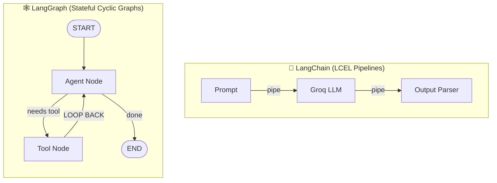

# 🦜 LangChain Deep Dive & Hands-On Tutorial with Groq

A complete, production-ready tutorial project designed to teach you **all core concepts of LangChain** through clean, runnable Python code with concise, pedagogical explanations.

Powered by **Groq** high-speed inference.

---

## 📚 Table of Contents
1. [Core Concepts Overview](#-core-concepts-overview)
2. [LangChain vs LangGraph: The Big Picture](#-langchain-vs-langgraph-the-big-picture)
3. [Project Structure](#-project-structure)
4. [Concept Breakdown & Lessons](#-concept-breakdown--lessons)
   - [Lesson 1: Models, Messages, Prompt Templates & Streaming](#lesson-1-models-messages-prompt-templates--streaming)
   - [Lesson 2: LCEL Chains (Pipe Operator, Parallel, Passthrough)](#lesson-2-lcel-chains-pipe-operator-parallel-passthrough)
   - [Lesson 3: Structured Outputs & Schema Enforcement (Pydantic)](#lesson-3-structured-outputs--schema-enforcement-pydantic)
   - [Lesson 4: Retrieval-Augmented Generation (RAG Pipeline)](#lesson-4-retrieval-augmented-generation-rag-pipeline)
   - [Lesson 5: Agents, Tools & The Evolution to LangGraph](#lesson-5-agents-tools--the-evolution-to-langgraph)
5. [Interactive Application](#-interactive-application)

---

## 🧠 Core Concepts Overview

| Concept | What It Is | Why It Matters |
| :--- | :--- | :--- |
| **`ChatPromptTemplate`** | Parameterized message template for LLMs. | Eliminates fragile string formatting; safely injects user variables into roles. |
| **LCEL (`\|` pipe operator)** | LangChain Expression Language for chain composition. | Declarative, Unix-pipe style composition of any `Runnable` components. |
| **`StrOutputParser`** | Output parser converting `AIMessage` to `str`. | Extracts clean text content directly from model responses. |
| **`RunnableParallel`** | Executes multiple chains concurrently on the same input. | Cuts latency by running independent LLM tasks in parallel (e.g. Pros vs Cons). |
| **`RunnablePassthrough`** | Passes input through unchanged to downstream chains. | Critical in RAG where the question is needed both by the retriever and the prompt. |
| **`with_structured_output`** | Model-level schema enforcement using Pydantic. | Guarantees typed, valid JSON objects for databases and APIs instead of freeform text. |
| **RAG Pipeline** | Retrieval-Augmented Generation. | Gives LLMs access to proprietary documents, company handbooks, and external databases. |
| **`RecursiveCharacterTextSplitter`** | Document chunking utility. | Splits text by paragraphs and sentences without cutting off mid-thought. |
| **`InMemoryVectorStore`** | Local, in-memory vector database. | Enables lightning-fast vector similarity search without external database infrastructure. |
| **`create_agent` & `@tool`** | Tool-calling reasoning agent. | Empowers LLMs to select tools, perform calculations, and query databases dynamically. |

---

## ⚖️ LangChain vs LangGraph: The Big Picture



| Feature | LangChain (Chains & LCEL) | LangGraph (Stateful Graphs) |
| :--- | :--- | :--- |
| **Core Paradigm** | Directed Acyclic Pipelines (Linear) | Directed Graphs with **Cycles / Loops** |
| **Composition** | Pipe operator: `A \| B \| C` | `StateGraph`, Nodes, Edges, Routers |
| **Best Used For** | RAG, Data Extraction, Text Transformations | Autonomous Agents, Multi-Turn Chat, HITL |
| **State** | Ephemeral (passed along pipeline) | Persistent, typed dictionary across steps |
| **Checkpoints** | Manual caching / buffers | Native checkpointer (`MemorySaver`, SQL) |
| **Human-in-the-Loop** | Complex to pause mid-chain | Built-in via `interrupt_before` |

---

## 📂 Project Structure

```text
Langraph/
├── main_langchain.py                    # Interactive launcher & test runner for LangChain
├── langchain_01_prompts_and_models.py   # Lesson 1: Messages, Templates, Streaming, Batching
├── langchain_02_lcel_chains.py          # Lesson 2: LCEL, Sequential, Parallel & Passthrough
├── langchain_03_structured_output.py    # Lesson 3: Pydantic schemas & JsonOutputParser
├── langchain_04_rag_pipeline.py         # Lesson 4: Ingestion, Chunking, Vectors & RAG
└── langchain_05_agents_and_tools.py     # Lesson 5: Tools, Modern Agents & Architecture
```

---

## 🚀 How to Run

### Run the Interactive Launcher
```bash
python main_langchain.py
```
This displays the interactive menu:
```text
======================================================================
          LANGCHAIN COMPREHENSIVE LEARNING SUITE
   Provider: Groq | Active Model: openai/gpt-oss-120b
======================================================================
 [1] Lesson 1: Models, Messages, Prompt Templates & Streaming
 [2] Lesson 2: LCEL Chains (Pipe Operator, Parallel, Passthrough)
 [3] Lesson 3: Structured Outputs & Schema Enforcement (Pydantic)
 [4] Lesson 4: Retrieval-Augmented Generation (RAG Pipeline)
 [5] Lesson 5: Agents, Tools & LangChain vs LangGraph Comparison
 [6] Run All Lessons (Verification Test Suite)
 [7] Launch Interactive LCEL Playground
 [0] Exit
======================================================================
```

### Run Any Lesson Directly
```bash
python langchain_01_prompts_and_models.py
python langchain_02_lcel_chains.py
python langchain_03_structured_output.py
python langchain_04_rag_pipeline.py
python langchain_05_agents_and_tools.py
```
