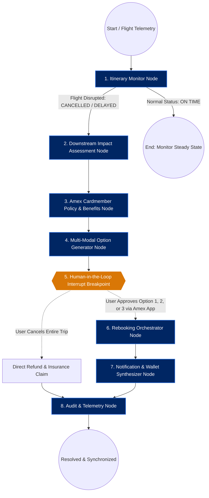
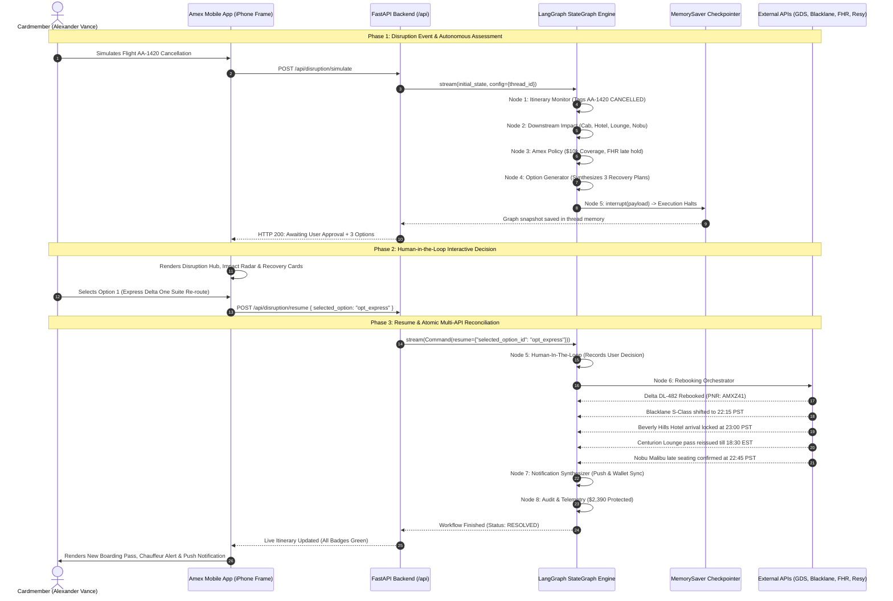

# 💳 American Express Travel Concierge: Advanced Multi-Modal Disruption Graph

An enterprise-grade, autonomous crisis recovery system built with **LangGraph**, **FastAPI**, and a pixel-perfect **American Express Mobile App UI**.

This application solves a critical problem in luxury travel: when a single leg of a multi-modal journey fails (e.g., a cross-country flight is cancelled), downstream reservations suffer catastrophic cascaded failures. The **Amex Travel Concierge Graph** automatically detects the flight cancellation, calculates the cross-domain temporal and financial impacts across **Cabs**, **Hotels**, **Lounges**, and **Fine Dining**, applies Amex Centurion/Platinum cardholder benefits, presents three synthesized multi-modal recovery packages to the cardmember via native **Human-in-the-Loop (HITL) interrupts**, and atomically synchronizes all rebooked services upon approval.

---

## 1. High-Level LangGraph Architecture Diagram



---

## 2. Human-in-the-Loop (HITL) Sequence Diagram

The following sequence diagram details the interaction between the **Cardmember**, the **Amex Mobile App**, **FastAPI**, and the **LangGraph State Machine** using the native `interrupt()` and `Command(resume=...)` pattern:



---

## 3. Deep Dive: The 8 LangGraph Nodes

| Node Index | Node Name | Responsibility & Domain Logic |
| :--- | :--- | :--- |
| **Node 1** | `itinerary_monitor_node` | Ingests airline flight status updates or disruption telemetry. When a `FLIGHT_CANCELLATION` or severe delay is flagged, updates the flight status to `CANCELLED` and transitions the workflow status from `IDLE` to `DISRUPTION_DETECTED`. |
| **Node 2** | `downstream_impact_node` | Performs temporal and spatial dependency calculations across all downstream reservations: calculates driver waiting fees or no-show forfeitures for **Blacklane Cabs**, late check-in room forfeiture risks for **The Beverly Hills Hotel**, expired terminal access windows for the **Centurion Lounge**, and late cancellation penalties (\$100/guest) for **Nobu Malibu**. Calculates total financial exposure (\$2,390.00). |
| **Node 3** | `amex_policy_node` | Evaluates cardmember tier privileges (The Centurion® Card / The Platinum Card®): unlocks **Amex Trip Interruption & Cancellation Insurance** (\$10,000 coverage limit), invokes **Fine Hotels & Resorts® (FHR)** guaranteed arrival hold, triggers **Global Dining Access by Resy** emergency waiver authority, and requests Centurion partner airline inventory. |
| **Node 4** | `option_generator_node` | Calls flight search, ground transport, hotel PMS, and dining APIs to synthesize 3 multi-modal recovery packages: **Option 1 (Express Same-Day Re-route on Delta One)**, **Option 2 (Luxury Overnight JFK Suite + Flagship First tomorrow)**, and **Option 3 (Full Trip Cancellation & \$8,940 Statement Credit)**. |
| **Node 5** | `human_in_the_loop_node` | **Native LangGraph Breakpoint.** Calls `interrupt(payload)` to pause graph execution and freeze state in `MemorySaver`. When resumed via `Command(resume=...)`, extracts the cardmember's chosen option and passes it to the execution engine. |
| **Node 6** | `rebooking_orchestrator_node` | Dispatches atomic API calls across all 5 dimensions simultaneously: rebooks airline ticket via GDS, updates Blacklane chauffeur pickup time and flight tracking, locks hotel late arrival guarantee, reissues digital Centurion Lounge barcode pass, and modifies dining reservation or issues penalty waiver. |
| **Node 7** | `notification_synthesizer_node` | Emits Amex executive push notification cards, updates Apple/Google digital wallet boarding passes, and synthesizes a personalized message from the Amex Platinum/Centurion Travel Concierge. |
| **Node 8** | `audit_telemetry_node` | Calculates end-to-end recovery metrics: total financial loss prevented (\$2,390.00 shielded), response latency, customer goodwill bonus points awarded (+10,000 pts), and commits the final checkpoint state. |

---

## 4. Multi-Modal Travel Tracking State Schema

The `TravelState` TypedDict maintains complete end-to-end trip state with custom reducers:

```python
class TravelState(TypedDict, total=False):
    # Cardmember Context
    user_id: str
    user_profile: Dict[str, Any]

    # Active Itinerary across 5 Multi-Modal Verticals
    itinerary: Dict[str, Any]  # 'flight', 'cab', 'hotel', 'lounge', 'dinner'

    # Telemetry & Disruption Event
    disruption: Optional[Dict[str, Any]]

    # Downstream Cascaded Analysis
    impact_assessment: List[Dict[str, Any]]
    total_financial_exposure: float
    critical_impact_count: int

    # Applied Card Protections
    policy_benefits: List[Dict[str, Any]]

    # Synthesized Recovery Packages
    options: List[Dict[str, Any]]

    # Human-In-The-Loop State
    selected_option_id: Optional[str]
    hitl_decision: Optional[Dict[str, Any]]
    hitl_interrupted: bool

    # Execution Receipts
    rebooking_receipts: List[Dict[str, Any]]

    # Reducer-Accumulated Notifications & Telemetry
    notifications: Annotated[List[Dict[str, Any]], append_notifications]
    audit_trail: Annotated[List[Dict[str, Any]], append_audit_logs]
    messages: Annotated[List[Any], add_messages]

    # Workflow Orchestration Flags
    workflow_status: str
    active_node: str
    completion_summary: Optional[Dict[str, Any]]
```

---

## 5. Multi-Modal Itinerary Components Tracked

1. ✈️ **Flight**:
   - Initial: American Airlines AA-1420 (Boeing 777-300ER Flagship First), JFK ➔ LAX, Seat 2B, PNR: AMX7X9.
   - Statuses: `ON_TIME` ➔ `CANCELLED` ➔ `REBOOKED`.
2. 🚕 **Cab / Chauffeur**:
   - Initial: Blacklane Executive Chauffeur (Mercedes-Benz S-Class), LAX Bradley VIP Curbside, Driver: Marcus Thorne, Pickup: 19:40 PST.
   - Statuses: `CONFIRMED` ➔ `RESCHEDULED`.
3. 🏨 **Hotel**:
   - Initial: The Beverly Hills Hotel & Bungalows (Dorchester Collection), Bungalow Garden Suite with Fireplace, Check-in: 20:30 PST, 3 Nights.
   - Statuses: `CONFIRMED` ➔ `CHECK_IN_EXTENDED`.
4. 🍸 **Airport Lounge**:
   - Initial: The Centurion® Lounge JFK Terminal 4, Digital Barcode: AMX-CENT-JFK-99824, Speakeasy cocktail bar access.
   - Statuses: `ACTIVE` ➔ `REISSUED`.
5. 🍽️ **Fine Dining**:
   - Initial: Nobu Malibu (Global Dining Access by Resy), VIP Oceanfront Patio, 2 Guests, 20:45 PST.
   - Statuses: `CONFIRMED` ➔ `RESCHEDULED` (or `CANCELLED_FEE_WAIVED`).

---

## 6. How to Run the Application

### Prerequisites
- Python 3.10+
- Virtual environment with dependencies installed: `fastapi`, `uvicorn`, `jinja2`, `langgraph`, `langchain-groq`, `python-dotenv`.

### Launch Server
Run the convenience runner from the project root:

```bash
# From c:\Users\azureuser\PycharmProjects\Langraph:
.\.venv\Scripts\python.exe amex_travel_concierge\run.py
```

Or run directly with Uvicorn:

```bash
.\.venv\Scripts\python.exe -m uvicorn app.main:app --app-dir amex_travel_concierge --host 0.0.0.0 --port 8000
```

### Access Mobile App
Open your web browser and navigate to:
👉 **`http://localhost:8000`**

### Test Scenarios
1. **Explore the Pristine State**:
   - View your Centurion card, Membership Rewards points balance (482,910 pts), and the 5 itinerary legs (Flight, Cab, Hotel, Lounge, Dinner) all marked green and on-schedule.
2. **Trigger Disruption**:
   - Click the red **"Simulate AA-1420 Cancellation"** button in the top cockpit toolbar.
   - Watch the LangGraph state machine run through Nodes 1, 2, 3, and 4, automatically pausing at Node 5 (Human-in-the-Loop Interrupt).
   - An urgent red disruption banner appears in the mobile app, and the Disruption Hub tab opens.
3. **Inspect the Cascaded Impacts & Recovery Packages**:
   - Notice how all 4 downstream reservations are flagged with their financial exposure (\$2,390 shielded).
   - Review the 3 recovery options generated by LangGraph.
4. **Approve Rebooking (Human-in-the-Loop)**:
   - Click **"Approve & Re-Synchronize Entire Trip"** on Option 1 (or Option 2 / 3).
   - The graph resumes with `Command(resume=...)`, executes Node 6 (Rebooking Orchestrator), Node 7 (Notifications), and Node 8 (Audit).
   - All itinerary cards refresh with new flight details, adjusted cab pickup times, extended hotel holds, and rescheduled dinner reservations!
5. **Chat with the Amex Concierge**:
   - Switch to the **Concierge** tab to ask questions powered by the Groq LLM with full context of your itinerary and disruption.
6. **Inspect the Live Graph**:
   - Switch to the **Graph Live** tab to view the live Mermaid diagram, active node execution status, and raw LangGraph state dictionary.
