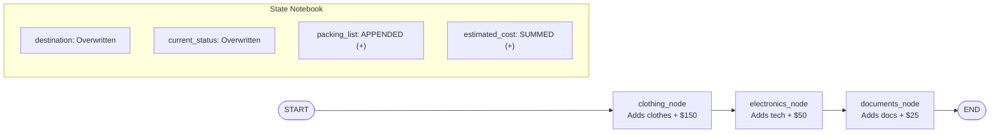

# Project 006: StateGraph Fundamentals & Reducers Made Simple

> **Stage**: Stage 1: Pure Fundamentals  
> **Difficulty**: 2.0 / 10 (Beginner Friendly)  
> **Primary Pillar**: `LangGraph`  
> **Auxiliary Disciplines**: None (Core Focus)  

---

## 🎯 The Core Concept in 30 Seconds

Think of **LangGraph State** as a **shared notebook** that gets passed from worker to worker:

1. **Default Behavior (Overwrite)**:
   - When a worker writes `current_status = "Planning"`, and the next worker returns `current_status = "Ready"`, the new value **completely overwrites** the old one. The notebook now says `"Ready"`.
2. **Reducer Behavior (`Annotated[..., operator.add]`)**:
   - What about a list of items, like a **Packing List**?
   - If Worker 1 adds `["Rain jacket"]`, and Worker 2 adds `["Power bank"]`, we **do not** want Worker 2 to erase the jacket!
   - By tagging the field with `Annotated[List[str], operator.add]`, you tell LangGraph:
     > *"Whenever any worker outputs items for this field, don't throw away the old items. Use the `+` operator to **append** new items to the existing list!"*
   - The same applies to numbers: `Annotated[int, operator.add]` will **sum** numbers ($150 + $50 + $25 = $225).

---

## 🏗️ Architecture & Control Flow



---

## 🔍 How It Works in Code

```python
from typing import TypedDict, Annotated, List
import operator

class VacationPlanState(TypedDict):
    destination: str                                   # Overwrites
    current_status: str                                # Overwrites
    packing_list: Annotated[List[str], operator.add]   # Appends lists!
    estimated_cost: Annotated[int, operator.add]       # Sums numbers!
```

---

## 📂 Project Structure

```text
006_only_langgraph_state_and_reducers/
├── README.md              # Concepts, quiz, and stretch challenge (this file)
├── requirements.txt       # Dependencies
├── config.py              # LLM client & automatic fallback resolution
├── main.py                # Beginner-friendly Trip Planner demonstration
└── test_verification.py   # Automated assertion tests
```

---

## 🚀 Execution & Verification

### 1. Run the Main Demonstration
```bash
python main.py
```
*Observe how `current_status` updates at every node, while `packing_list` accumulates items without losing anything, and `estimated_cost` sums up automatically.*

### 2. Run the Verification Tests
```bash
python test_verification.py
```

---

## 💡 Concept Self-Quiz (Test Your Understanding)

1. **Question**: What happens to a field in LangGraph state if you DO NOT use `Annotated[..., reducer]`?
   - **Answer**: By default, LangGraph simply overwrites the field with whatever the most recent node returned. If Node 1 returned `{"items": ["apple"]}` and Node 2 returned `{"items": ["banana"]}`, the state would only contain `["banana"]`.

2. **Question**: What does `operator.add` actually do?
   - **Answer**: `operator.add` is Python's standard `+` function (`operator.add(a, b)` is identical to `a + b`). If `a` and `b` are lists (`["a"] + ["b"]`), it concatenates them into `["a", "b"]`. If `a` and `b` are integers (`10 + 20`), it sums them to `30`.

3. **Question**: Does every node have to return all fields in the `TypedDict`?
   - **Answer**: No! Nodes only need to return the specific keys they want to update. Any fields not returned by a node remain completely untouched in the state.

---

## 🛠️ Hands-on Stretch Challenge

Modify `main.py` to add a **4th Worker Node**:
- Create a `snacks_node` that suggests 2 local treats or snacks for the trip (e.g., `"Matcha KitKats"`, `"Rice Crackers"`).
- Have it add `$15` to the `estimated_cost` and append the snacks to `packing_list`.
- Wire `documents_node -> snacks_node -> END`.
- Run `python main.py` and verify that the final packing list now has 8 items and total cost is $240!
