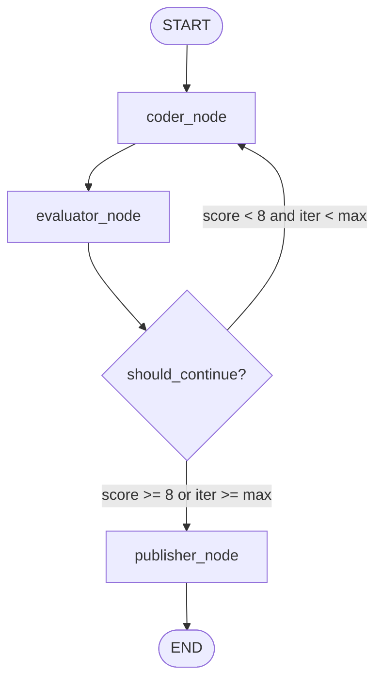

# Project 007: Conditional Edges, Dynamic Routing & Graph Cycles

> **Stage**: Stage 1: Pure Fundamentals  
> **Difficulty**: 2.5 / 10 (Intermediate)  
> **Primary Pillar**: `LangGraph`  
> **Auxiliary Disciplines**: Production Guardrails (Loop breaker pattern)  

---

## 🎯 Learning Objective
Master the implementation of dynamic branching with `add_conditional_edges()`, state-driven router functions, iterative cycles (evaluator-coder feedback loops), and safety guardrails that prevent infinite loops.

---

## 🧠 Key Concepts Covered

1. **`add_conditional_edges(source, path, path_map)`**:
   - Instead of hardwired transition edges (`add_edge(A, B)`), a conditional edge inspects the current graph state after node `source` finishes, passes that state to a routing function `path`, and routes execution according to the returned key in `path_map`.
2. **Router Functions**:
   - Pure Python functions (`should_continue(state) -> str`) that make deterministic or heuristic routing decisions based on attributes in the state (e.g. `quality_score`, `iteration`, `error_flag`).
3. **Graph Cycles (Feedback Loops)**:
   - Defining a directed cycle where node `B` routes back to node `A`. This is the fundamental engine behind iterative code generation, self-correcting agents, and reflection workflows.
4. **Termination Guardrails (Loop Breakers)**:
   - In production systems, agents might get stuck in endless critique-refine loops. A mandatory safety counter (`iteration >= max_iterations`) guarantees that the graph terminates gracefully even if the convergence threshold is not met.

---

## 🏗️ Architecture & Control Flow



---

## 📂 Project Structure

```text
007_only_langgraph_conditional_routing/
├── README.md              # Documentation, quiz & challenge
├── requirements.txt       # Dependencies
├── config.py              # LLM client & fallback resolution
├── main.py                # Runnable cyclic code refiner
└── test_verification.py   # Automated assertion test suite
```

---

## 🚀 Execution & Verification

### 1. Run the Main Demonstration
```bash
python main.py
```
*Observe the terminal output as the evaluator inspects generated code, scores it, and either routes back to the coder for refinements or forwards it to the publisher.*

### 2. Run the Automated Test Suite
```bash
python test_verification.py
```

---

## 💡 Concept Self-Quiz (Test Your Understanding)

1. **Question**: What is the difference between a normal edge created via `add_edge()` and a conditional edge created via `add_conditional_edges()`?
   - **Answer**: `add_edge(A, B)` creates a static, unconditional transition from node A to node B. Every time node A finishes, node B is executed. In contrast, `add_conditional_edges(A, router_func, path_map)` calls `router_func(state)` dynamically at runtime and routes to whichever destination node is returned by the router function, enabling branching and cyclical loops.

2. **Question**: Why is a `max_iterations` guardrail crucial when designing cyclic graphs with LLMs?
   - **Answer**: LLM outputs are stochastic and an LLM evaluator might give contradictory or unsatisfiable critique. Without a deterministic numeric cap on iterations checked inside the router function, the graph could loop infinitely, consuming token budgets and hanging the system.

3. **Question**: Does a router function modify the graph state?
   - **Answer**: No. A router function is a read-only inspect function. It takes the state as input and returns a string (the key identifying the destination node). State mutations should only occur inside nodes.

---

## 🛠️ Hands-on Stretch Challenge

Modify `main.py` to support **multi-criteria conditional routing**:
- Update `evaluator_node` to assess two separate scores: `correctness_score` (1-10) and `style_score` (1-10).
- Update the router to send code to a dedicated `style_formatter_node` if `correctness_score >= 8` but `style_score < 7`.
- Re-run `main.py` and inspect how the graph branches dynamically across different specialized worker nodes.
