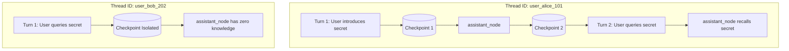

# Project 008: Checkpoints, MemorySaver & State Persistence

> **Stage**: Stage 1: Pure Fundamentals  
> **Difficulty**: 3.0 / 10 (Intermediate)  
> **Primary Pillar**: `LangGraph`  
> **Auxiliary Disciplines**: Agent Memory (Working Memory Isolation)  

---

## 🎯 Learning Objective
Master LangGraph state persistence using Checkpointers (`MemorySaver`), isolating conversational contexts across `thread_id` sessions, and inspecting execution snapshots through `get_state()` and `get_state_history()`.

---

## 🧠 Key Concepts Covered

1. **Checkpointers (`MemorySaver`)**:
   - A checkpointer automatically takes a snapshot of the graph state after every single super-step (node execution). This allows graphs to pause, recover from failures, rewind in time, or resume conversations without reloading state from external databases.
2. **Execution Configuration (`thread_id`)**:
   - When invoking a compiled graph with a checkpointer, you supply a configuration dictionary: `config={"configurable": {"thread_id": "<id>"}}`.
   - The `thread_id` acts as a primary key partitioning the checkpoint store. Two different `thread_id`s never share or leak memory.
3. **`add_messages` Reducer**:
   - Special reducer from `langgraph.graph.message` that handles message appending, deduplication, and ID assignment for `HumanMessage`, `AIMessage`, and `SystemMessage`.
4. **State & History Inspection**:
   - `graph.get_state(config)`: Retrieves the current `StateSnapshot` including values and next runnable nodes.
   - `graph.get_state_history(config)`: Iterates backward over all historical snapshots saved for that thread.

---

## 🏗️ Architecture & Control Flow



---

## 📂 Project Structure

```text
008_only_langgraph_checkpoints_persistence/
├── README.md              # Documentation, quiz & challenge
├── requirements.txt       # Dependencies
├── config.py              # LLM client & fallback resolution
├── main.py                # Multi-turn assistant with MemorySaver
└── test_verification.py   # Automated assertion test suite
```

---

## 🚀 Execution & Verification

### 1. Run the Main Demonstration
```bash
python main.py
```
*Observe how Alice's thread remembers her secret codename across turns without re-submitting history, while Bob's thread remains strictly isolated.*

### 2. Run the Automated Test Suite
```bash
python test_verification.py
```

---

## 💡 Concept Self-Quiz (Test Your Understanding)

1. **Question**: What happens if you compile a StateGraph with a `checkpointer` but invoke it without passing a `thread_id` in `config`?
   - **Answer**: LangGraph will raise an error (e.g. `ValueError: Checkpointer requires a 'thread_id' to be set in the config`). A checkpointer cannot organize or save snapshots without a partition key.

2. **Question**: How does `MemorySaver` compare to production persistence checkpointers like `PostgresSaver` or `SqliteSaver`?
   - **Answer**: `MemorySaver` stores state snapshots purely in volatile RAM inside a Python dictionary. When the Python process terminates, all history is lost. `PostgresSaver` and `SqliteSaver` implement the same `BaseCheckpointSaver` interface but serialize checkpoints to durable SQL databases, allowing long-term persistence across process restarts and horizontal server scaling.

3. **Question**: When a new turn is executed on an existing `thread_id`, how does LangGraph know what the previous state was?
   - **Answer**: Before running any node, LangGraph queries the checkpointer using the provided `thread_id`, loads the most recent checkpoint snapshot into memory, merges the incoming invocation payload into the state using the defined reducers, and passes the resulting state to the starting node.

---

## 🛠️ Hands-on Stretch Challenge

Modify `main.py` to demonstrate **Time Travel (Checkpoint Rewind)**:
- Run 3 consecutive turns in a thread.
- Use `graph.get_state_history(config)` to grab the `checkpoint_id` from Turn 1.
- Pass `config={"configurable": {"thread_id": "...", "checkpoint_id": prior_id}}` to resume execution or fork a new alternate reality from that historical state.
