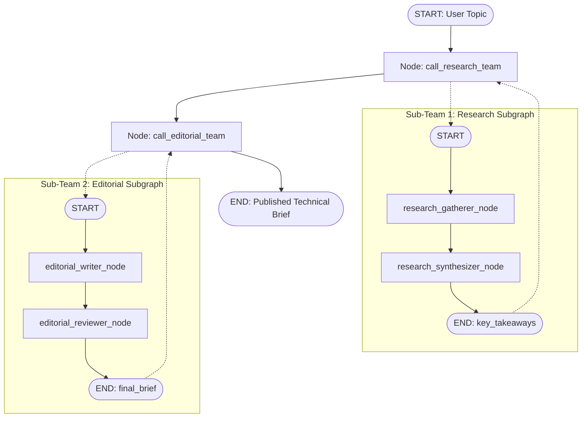

# Project 010: Subgraphs & Hierarchical Multi-Agent Systems

> **Stage**: Stage 1: Pure Fundamentals  
> **Difficulty**: 4.0 / 10 (Intermediate - Advanced)  
> **Primary Pillar**: `LangGraph`  
> **Auxiliary Disciplines**: Multi-Agent Systems (MAS)  

---

## 🎯 Learning Objective
Master the composition of hierarchical, multi-agent systems in LangGraph by designing domain-specific Subgraphs, encapsulating isolated states, bridging parent-child state schemas, and orchestrating complex pipelines cleanly.

---

## 🧠 Key Concepts Covered

1. **Subgraphs as Modular Building Blocks**:
   - In complex enterprise architectures, placing dozens of nodes into a single monolithic graph causes state schema bloat and high coupling.
   - Subgraphs solve this by allowing each functional unit (e.g. Research Team, Coding Team, Review Team) to be built and compiled as its own independent `StateGraph`.
2. **State Encapsulation & Domain Separation**:
   - The child subgraph defines its own `TypedDict` containing only the fields it requires.
   - Intermediate scratchpad variables used inside the child graph do not clutter the parent graph's state.
3. **Parent-to-Child State Adapters**:
   - A parent node function extracts relevant fields from the parent state, transforms them into the child subgraph's input schema, invokes the compiled child graph (`child_subgraph.invoke(child_input)`), and returns updates mapped back to the parent state.
4. **Independent Unit Testability**:
   - Because subgraphs are self-contained compiled graphs, engineers can write isolated unit tests for individual agent teams without spinning up the entire parent application.

---

## 🏗️ Architecture & Control Flow



---

## 📂 Project Structure

```text
010_only_langgraph_subgraphs_hierarchies/
├── README.md              # Documentation, quiz & challenge
├── requirements.txt       # Dependencies
├── config.py              # LLM client & fallback resolution
├── main.py                # Hierarchical multi-agent publication pipeline
└── test_verification.py   # Isolated subgraph and parent test suite
```

---

## 🚀 Execution & Verification

### 1. Run the Main Demonstration
```bash
python main.py
```
*Observe how the parent orchestrator seamlessly delegates technical topic analysis to the Research Subgraph, captures synthesized takeaways, passes them into the Editorial Subgraph, and outputs a published executive brief.*

### 2. Run the Automated Test Suite
```bash
python test_verification.py
```

---

## 💡 Concept Self-Quiz (Test Your Understanding)

1. **Question**: What are the primary architectural benefits of dividing a complex agent into subgraphs rather than having one massive StateGraph?
   - **Answer**: Subgraphs enforce separation of concerns, eliminate state pollution (where unrelated nodes share a bloated single dictionary), simplify debugging, and allow different engineering teams to independently build, version, and unit test individual sub-agent workflows.

2. **Question**: Can a subgraph have its own internal checkpointer or conditional cycles?
   - **Answer**: Yes! A subgraph is a full-fledged `CompiledStateGraph`. It can have internal conditional edges, loops, its own checkpointer, and even its own subgraphs nested further down.

3. **Question**: When nesting a subgraph directly as a node (`parent.add_node("sub", child_graph)`), what must be true about the state schemas?
   - **Answer**: When added directly without an adapter wrapper, the child graph must accept the parent state's schema (or a subset of overlapping keys). If the schemas differ significantly, a wrapper node function acts as an adapter mapping parent state -> child input and child output -> parent state.

---

## 🛠️ Hands-on Stretch Challenge

Modify `main.py` to add a **Third Subgraph (Translation Subgraph)**:
- Create a `TranslationState` (`text: str`, `target_language: str`, `translated_text: str`).
- Build and compile a `translation_subgraph` with nodes to translate and verify fluency.
- Add a third stage to the parent orchestrator so the executive brief is automatically translated into French, Spanish, or German.
