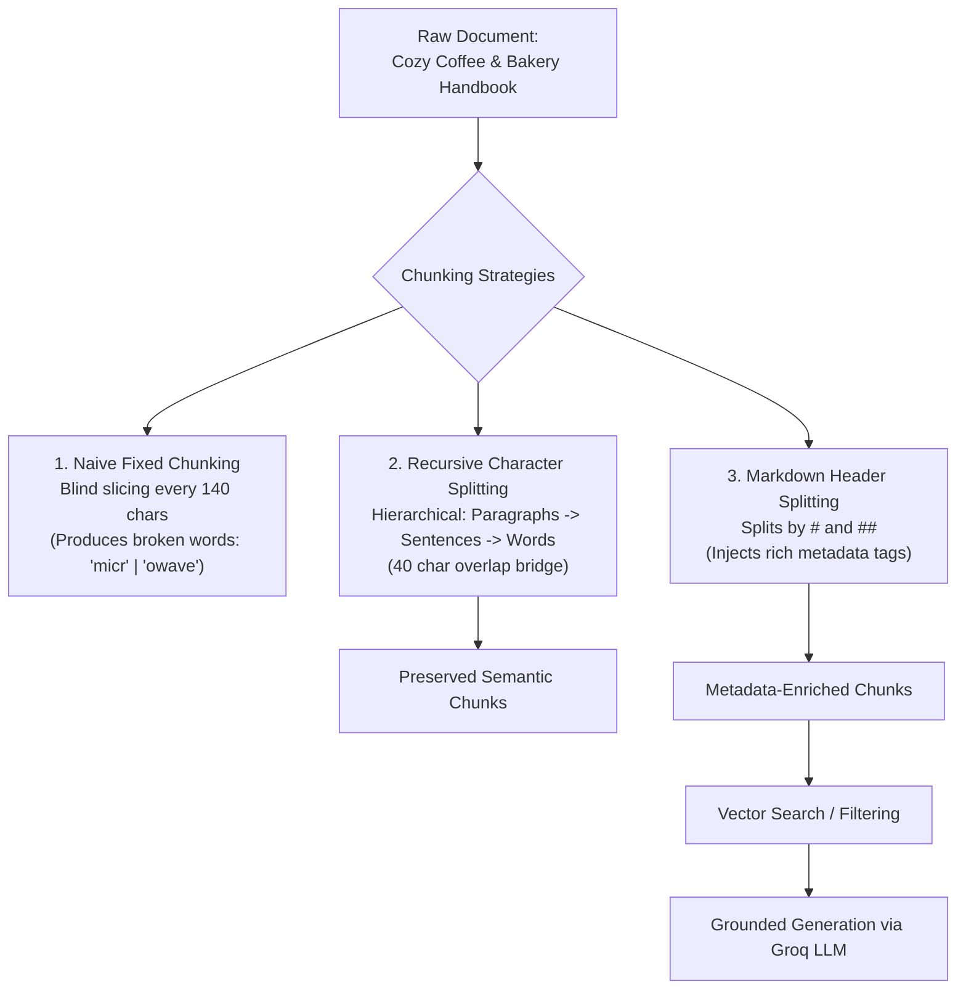

# Project 016: Document Ingestion & Chunking Strategy Benchmark

> **Stage**: Stage 1: Pure Fundamentals  
> **Difficulty**: 2.0 / 10 (Beginner Friendly)  
> **Primary Pillar**: `RAG`  
> **Auxiliary Disciplines**: Data Preprocessing & Document Parsing  

---

## 🎯 The Big Question: Why Chunking is Mandatory in RAG

When building a Retrieval-Augmented Generation (RAG) system, you cannot simply feed a 100-page employee manual, financial statement, or code repository directly into an embedding model:
1. **Embedding Context Limits**: Embedding models have fixed input context windows (e.g. 512, 1024 tokens).
2. **Loss of Specificity (Semantic Blurring)**: If you compress 100 pages into a single vector, it becomes a generic blur of all topics. Finding a specific sentence or password becomes impossible.
3. **LLM Attention & Cost**: Injecting entire documents into an LLM prompt inflates latency, drains token budgets, and causes "lost-in-the-middle" retrieval failure.

**Chunking** is the process of breaking long documents into small, semantically coherent segments suitable for vector search.

---

## 🧠 Core Chunking Strategies Compared

### 1. Naive Fixed-Character Chunking
- Slices text blindly every $N$ characters (e.g. `text[0:150]`, `text[150:300]`).
- **The Critical Flaw**: Slices words and sentences right down the middle! Words like `"microwave"` become `"micr"` in Chunk 1 and `"owave"` in Chunk 2. Semantic search fails because the word is broken.

### 2. Recursive Character Splitting (`RecursiveCharacterTextSplitter`)
- The **Industry Gold Standard** text splitter.
- Evaluates a hierarchy of separators:
  1. `\n\n` (Paragraphs)
  2. `\n` (Sentences / lines)
  3. ` ` (Spaces between words)
  4. `""` (Characters — used only as an absolute last resort if a single word exceeds `chunk_size`)
- Keeps paragraphs and sentences intact whenever they fit within `chunk_size`.

### 3. The Power of Chunk Overlap (`chunk_overlap`)
- What happens if a critical fact straddles the boundary?
  - *Without Overlap*: Chunk 1 ends with `"The secret Wi-Fi password is"`, Chunk 2 starts with `"'MochaLatte#2026!'."` Neither chunk contains both question and answer!
  - *With Overlap (e.g. 40 characters)*: Chunk 1 and Chunk 2 share a sliding-window margin, guaranteeing that concepts spanning boundaries are never lost.

### 4. Structural Markdown Header Splitting (`MarkdownHeaderTextSplitter`)
- Slices documents using native structural markers (`#`, `##`, `###`).
- Automatically enriches each chunk with **Metadata Tags** (e.g. `{"Document Title": "Handbook", "Section Title": "2. Kitchen Safety"}`).
- Enables metadata filtering prior to semantic retrieval.

---

## 🏗️ Architecture & Control Flow



---

## 📂 Project Structure

```text
016_only_rag_chunking_strategies/
├── README.md              # Complete guide, quiz, and stretch challenge (this file)
├── requirements.txt       # Dependencies (langchain-text-splitters, etc.)
├── config.py              # LLM client & automatic fallback resolution
├── main.py                # Runnable benchmark on Coffee Shop Handbook
└── test_verification.py   # Automated assertion tests
```

---

## 🚀 Execution & Verification

### 1. Run the Main Demonstration
```bash
python main.py
```
*Observe the visual comparison between naive slicing (broken words) and recursive splitting, view the comparative benchmark summary table, and see live question answering grounded on the retrieved section.*

### 2. Run the Verification Tests
```bash
python test_verification.py
```

---

## 💡 Concept Self-Quiz (Test Your Understanding)

1. **Question**: Why does `RecursiveCharacterTextSplitter` produce fewer broken words than a simple `CharacterTextSplitter`?
   - **Answer**: `RecursiveCharacterTextSplitter` checks separators in order of decreasing granularity (`["\n\n", "\n", " ", ""]`). It will only split at a space between words if the paragraph cannot fit as a whole, meaning it never cuts inside a word unless that single word is longer than `chunk_size`.

2. **Question**: What is the danger of setting `chunk_overlap` too high or too low?
   - **Answer**: If `chunk_overlap` is too low (or 0), key contextual relationships spanning chunk boundaries are severed. If `chunk_overlap` is too high (e.g. 50% or more of `chunk_size`), you produce duplicate tokens across chunks, bloating vector storage costs and confusing rerankers. A standard rule of thumb is 10% to 20% overlap.

3. **Question**: How does metadata attached during chunking (e.g. `MarkdownHeaderTextSplitter`) improve RAG performance?
   - **Answer**: Metadata tags allow hard pre-filtering or hybrid filtering in VectorDBs (e.g., `filter={"section": "Security"}`). This narrows the search space before running semantic nearest-neighbor search, eliminating irrelevant results and hallucinations.

---

## 🛠️ Hands-on Stretch Challenge

Modify `main.py` to test **Code-Aware Chunking**:
- Add a sample Python code file containing a class and two functions.
- Import `from langchain_text_splitters import Language, RecursiveCharacterTextSplitter`.
- Use `RecursiveCharacterTextSplitter.from_language(language=Language.PYTHON, chunk_size=150, chunk_overlap=20)`.
- Observe how Python-aware chunking prioritizes splitting on `class` and `def` boundaries rather than arbitrary sentences!
