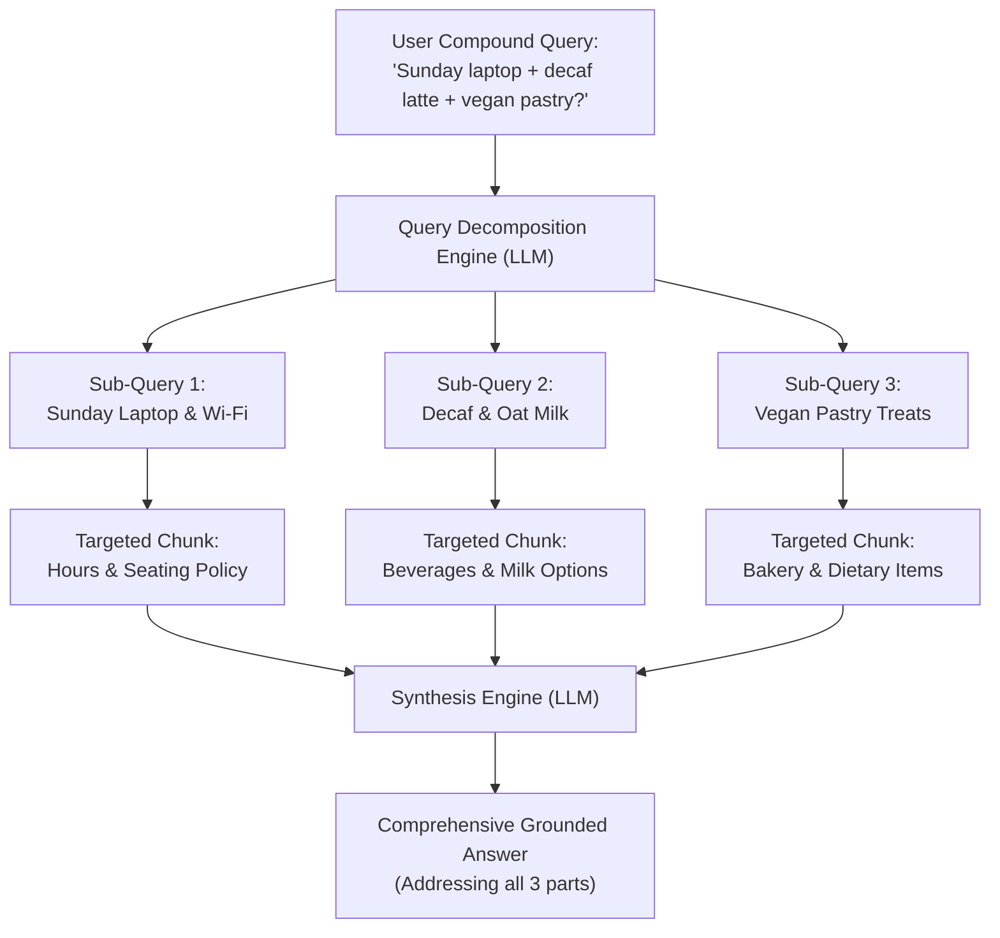

# Project 017: Query Transformation, Multi-Query & Sub-Questions

> **Stage**: Stage 1: Pure Fundamentals  
> **Difficulty**: 2.5 / 10 (Beginner Friendly)  
> **Primary Pillar**: `RAG`  
> **Auxiliary Disciplines**: Search Optimization & Query Engineering  

---

## 🎯 The Big Problem: Why Naive RAG Fails on Complex Queries

Real-world users do not ask convenient, single-sentence questions formatted like database lookups.
They ask **compound questions** spanning multiple domains:
> *"Can I bring my laptop to work on Sunday morning, and do you have decaf oat lattes and vegan pastry treats?"*

If you feed that compound question directly into a standard vector search:
1. **The Semantic Mismatch Trap**: The vector database looks for a single chunk that mentions laptops, Sunday hours, decaf espresso, oat milk, AND vegan pastries.
2. **Context Fragmentation**: In reality, opening hours are in the Operations handbook, milk substitutions are in the Beverage guide, and vegan items are in the Bakery menu.
3. **The Result**: The vector search misses critical chunks, leading to incomplete answers or hallucinations.

---

## 🧠 Core Solutions Demonstrated

### 1. Multi-Query Expansion
- An LLM rephrases the user's question into multiple distinct variations (e.g. replacing *"Wi-Fi"* with *"internet quality"*, *"connection speed"*).
- Running retrieval across all variations overcomes synonym mismatches and dramatically increases search recall.

### 2. Sub-Question Decomposition
- The compound question is broken down into independent atomic sub-questions:
  - Sub-Q 1: *"Can I bring my laptop to work on Sunday morning?"* -> Routes to **Operations / Hours** chunk.
  - Sub-Q 2: *"Do you offer decaf oat lattes?"* -> Routes to **Beverage Menu** chunk.
  - Sub-Q 3: *"Do you have any vegan pastry treats?"* -> Routes to **Bakery Menu** chunk.

### 3. Multi-Context Synthesis
- Each sub-question retrieves its own dedicated chunk.
- A final synthesis LLM prompt takes the user's original question and all retrieved evidence chunks to produce a comprehensive, structured, and fully grounded response.

---

## 🏗️ Architecture & Control Flow



---

## 📂 Project Structure

```text
017_only_rag_query_decomposition/
├── README.md              # Complete guide, quiz, and stretch challenge (this file)
├── requirements.txt       # Dependencies
├── config.py              # LLM client & automatic fallback resolution
├── main.py                # Runnable Multi-Query & Decomposition pipeline
└── test_verification.py   # Automated assertion tests
```

---

## 🚀 Execution & Verification

### 1. Run the Main Demonstration
```bash
python main.py
```
*Observe how a complex 3-part customer question is broken down into clean sub-queries, each retrieving the exact right chunk from the knowledge base, before being combined into an accurate final response.*

### 2. Run the Verification Tests
```bash
python test_verification.py
```

---

## 💡 Concept Self-Quiz (Test Your Understanding)

1. **Question**: What is the difference between Multi-Query Expansion and Sub-Question Decomposition?
   - **Answer**: Multi-Query Expansion generates *alternative ways of asking the same single question* (to find documents using different wording or synonyms). Sub-Question Decomposition breaks a *multi-part question into several distinct smaller questions* (to retrieve different pieces of evidence across separate documents).

2. **Question**: When should an application use Query Decomposition versus standard retrieval?
   - **Answer**: Use standard retrieval for simple, atomic questions (*"What is the phone number?"*). Use Query Decomposition when questions involve comparisons (*"Compare product A vs B"*), multi-step reasoning, or multiple distinct intents in a single prompt.

3. **Question**: What is Step-Back Prompting?
   - **Answer**: Step-Back Prompting is an advanced query transformation technique where the LLM is prompted to take a "step back" and ask a broader, more fundamental background question (e.g. asking *"What are the principles of Newton's laws?"* before answering a complex physics problem).

---

## 🛠️ Hands-on Stretch Challenge

Modify `main.py` to add **Step-Back Prompting**:
- Add a function `generate_step_back_query(query: str) -> str` that asks the LLM: *"What is the broader underlying principle or background concept behind this question?"*
- Retrieve a high-level background document along with the specific sub-question chunks.
- Pass both the specific evidence and the background context into the final synthesizer and note how much richer the explanation becomes!
