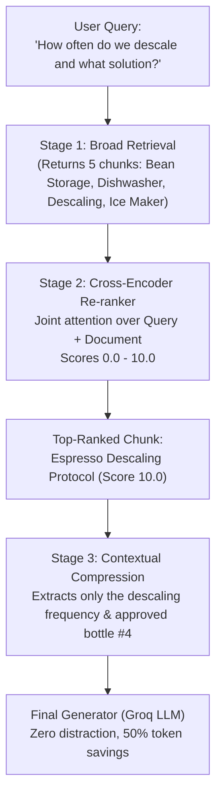

# Project 018: Contextual Compression & Cross-Encoder Re-ranking

> **Stage**: Stage 1: Pure Fundamentals  
> **Difficulty**: 3.0 / 10 (Intermediate)  
> **Primary Pillar**: `RAG`  
> **Auxiliary Disciplines**: Cost Optimization & LLM Attention Management  

---

## 🎯 The Big Problem: The Retrieval Quality vs Quantity Dilemma

In early RAG designs, engineers often retrieve 10 to 20 chunks to "be safe" and avoid missing the answer.
This creates two severe production failures:
1. **The "Lost-in-the-Middle" Phenomenon**:
   LLMs have high attention at the prompt's beginning and end, but suffer catastrophic recall degradation for facts positioned in the middle of a massive context window.
2. **Bi-Encoder Blind Spots**:
   Vector embeddings (Bi-Encoders) encode the query and document independently into vectors. They are fast for candidate generation, but frequently return superficial keyword matches or irrelevant distractors.

---

## 🧠 Two-Stage Retrieval Architecture

To achieve enterprise-grade precision, modern RAG systems use a **Two-Stage Funnel**:

```text
[All Documents (Millions)]
         |
         v (Stage 1: Fast Bi-Encoder Search)
  [Top 10-20 Candidates]
         |
         v (Stage 2: Cross-Encoder / LLM Re-ranker)
  [Top 2-3 High-Precision Chunks]
         |
         v (Stage 3: Contextual Compression)
  [Clean, Extracted Answering Sentences]
         |
         v (Final LLM Generation)
  [Accurate, Grounded Answer]
```

---

## 🏗️ Architecture & Control Flow



---

## 📂 Project Structure

```text
018_only_rag_reranking_compression/
├── README.md              # Complete guide, quiz, and stretch challenge (this file)
├── requirements.txt       # Dependencies
├── config.py              # LLM client & automatic fallback resolution
├── main.py                # Runnable Re-ranking & Compression pipeline
└── test_verification.py   # Automated assertion tests
```

---

## 🚀 Execution & Verification

### 1. Run the Main Demonstration
```bash
python main.py
```
*Observe how 5 noisy candidate chunks are scored, filtered down to the single best document, compressed by nearly 50% to remove filler, and fed to the LLM for a laser-accurate answer.*

### 2. Run the Verification Tests
```bash
python test_verification.py
```

---

## 💡 Concept Self-Quiz (Test Your Understanding)

1. **Question**: Why can't we use a Cross-Encoder for the entire database search instead of a Bi-Encoder?
   - **Answer**: Cross-Encoders concatenate the query and document together (`[CLS] Query [SEP] Document [SEP]`) and pass them through every transformer attention layer. This takes significant compute per document. Doing this against 1,000,000 documents would take minutes or hours. A Bi-Encoder pre-computes document vectors offline, allowing vector search in milliseconds. Thus, Bi-Encoders generate candidate pools, and Cross-Encoders re-rank the top 10-20.

2. **Question**: What is Contextual Compression?
   - **Answer**: Contextual Compression is the post-retrieval process of filtering, summarizing, or extracting only the relevant snippets from retrieved chunks relative to the user query before passing them to the final LLM prompt, reducing context bloat and preventing distraction.

3. **Question**: What is the "Lost-in-the-Middle" effect?
   - **Answer**: A well-documented empirical behavior where LLMs are significantly better at retrieving and reasoning over information placed at the very beginning or end of their input context, while frequently missing critical facts located in the middle 60% of long prompts.

---

## 🛠️ Hands-on Stretch Challenge

Modify `main.py` to add **Relevance Thresholding & Abstention**:
- Ask a query that is completely absent from all 5 chunks (e.g. *"What is the employee health insurance deductible?"*).
- Observe how the re-ranker assigns all 5 chunks a score < 3.0.
- Implement an abstention guardrail: if no chunk scores >= 6.0, return *"I am sorry, but our maintenance handbook does not contain information on health insurance."* without invoking the final generator!
