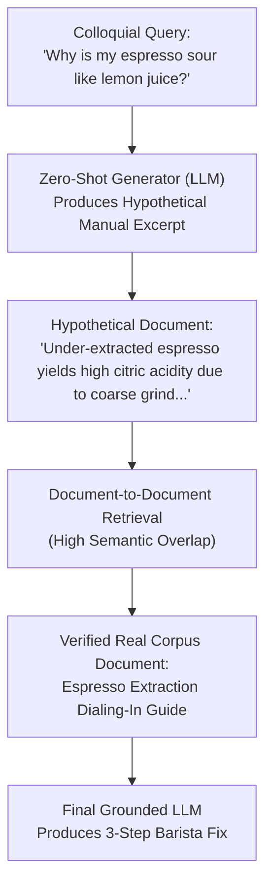

# Project 019: HyDE (Hypothetical Document Embeddings) for Deep Search

> **Stage**: Stage 1: Pure Fundamentals  
> **Difficulty**: 3.0 / 10 (Intermediate)  
> **Primary Pillar**: `RAG`  
> **Auxiliary Disciplines**: Zero-Shot Retrieval & Representation Learning  

---

## 🎯 The Big Problem: Query-to-Document Asymmetry

When a user searches a knowledge base, their query is almost always:
1. **Short & Informal**: *"Why is my espresso tasting super sour like lemon juice?"*
2. **Missing Jargon**: Non-expert users do not know the formal technical terms used by manuals (*"under-extraction"*, *"grind particle distribution"*, *"channeling"*).

In dense vector embedding models, short interrogative queries and long technical paragraphs sit in completely different areas of the vector space. As a result, vector similarity often drops, leading to retrieval failures.

---

## 🧠 The HyDE Solution (Gao et al., 2022)

Instead of comparing the short query directly to the database:
1. **Generate a Hypothetical Document**:
   We prompt an LLM: *"Write a short, highly technical manual excerpt that answers this question."*
2. **The Synthetic Bridge**:
   Even if the LLM's hypothetical document contains minor inaccuracies, it generates the **exact technical vocabulary, sentence structure, and tone** of a real document.
3. **Document-to-Document Retrieval**:
   We search the database using the *hypothetical document*. Because documents look like documents, dense retrieval accuracy increases dramatically.
4. **Grounded Generation**:
   The retrieved verified real document is passed to the final LLM, guaranteeing factual answers.

---

## 🏗️ Architecture & Control Flow



---

## 📂 Project Structure

```text
019_only_rag_hyde_expansion/
├── README.md              # Complete guide, quiz, and stretch challenge (this file)
├── requirements.txt       # Dependencies
├── config.py              # LLM client & automatic fallback resolution
├── main.py                # Runnable HyDE pipeline on Barista Troubleshooting Guide
└── test_verification.py   # Automated assertion tests
```

---

## 🚀 Execution & Verification

### 1. Run the Main Demonstration
```bash
python main.py
```
*Observe how the LLM transforms a casual question about 'lemon juice' into a dense technical paragraph, boosting search confidence and retrieving the official grind calibration guide.*

### 2. Run the Verification Tests
```bash
python test_verification.py
```

---

## 💡 Concept Self-Quiz (Test Your Understanding)

1. **Question**: What happens if the LLM hallucinates fake facts in the hypothetical document? Does that corrupt the final answer?
   - **Answer**: No! The hypothetical document is used purely as an ephemeral search query vector to find real documents in the database. The final answer is generated strictly from the *retrieved, verified documents*, not from the hypothetical document.

2. **Question**: When is HyDE most beneficial, and when is it unnecessary?
   - **Answer**: HyDE is most beneficial for complex, jargon-heavy, or non-expert queries where users describe symptoms rather than solutions (e.g. medical symptoms, IT troubleshooting, legal queries). It is unnecessary for simple lookup queries (*"What is the phone number?"*) where keyword search or standard dense retrieval already succeeds.

3. **Question**: Does HyDE add latency to a RAG pipeline?
   - **Answer**: Yes. HyDE requires an additional LLM generation call before performing retrieval. In production systems with strict latency requirements, fast smaller models (or speculative decoding) are used for the HyDE generation step.

---

## 🛠️ Hands-on Stretch Challenge

Modify `main.py` to implement **Multi-HyDE (Ensemble HyDE)**:
- Generate 3 distinct hypothetical documents using slight temperature variations (e.g., one focusing on grind size, one on water temperature, one on bean roast level).
- Retrieve documents for each hypothetical variation.
- Take the union of retrieved documents and inspect how ensemble diversity catches different edge cases!
