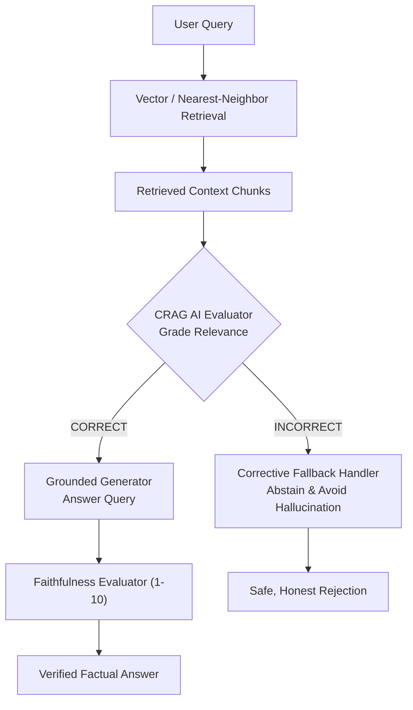

# Project 020: CRAG (Corrective RAG) with AI Evaluation Metrics

> **Stage**: Stage 1: Pure Fundamentals  
> **Difficulty**: 3.5 / 10 (Intermediate)  
> **Primary Pillar**: `RAG`  
> **Auxiliary Disciplines**: AI Evaluation & Hallucination Prevention  

---

## 🎯 The Big Problem: The Blind Faith of Standard RAG

In traditional RAG pipelines, the system follows a rigid, non-evaluative path:
```text
User Query -> Vector Search -> [Retrieved Chunks] -> LLM Answers
```

If a user asks a question about an out-of-domain topic or an entity not present in your database, vector search still dutifully returns the nearest vectors. The LLM receives these irrelevant chunks and tries to invent connections, producing confident **hallucinations** that erode user trust.

---

## 🧠 The CRAG Architecture (Yan et al., 2024)

Corrective RAG inserts an **AI Evaluator / Retrieval Grader** between retrieval and generation to verify evidence before the LLM speaks:

1. **Relevance Grading**:
   - Evaluates retrieved chunks against the user query, categorizing them into:
     - **CORRECT**: Chunk directly answers the query. -> *Proceeds to generation.*
     - **AMBIGUOUS**: Chunk has related keywords but incomplete evidence. -> *Applies context refinement / filtering.*
     - **INCORRECT**: Chunk lacks answering evidence. -> *Triggers **Corrective Action**!*
2. **Corrective Routing**:
   - When retrieval is graded `INCORRECT`, the pipeline halts standard generation and routes to a corrective fallback (e.g. web search, escalation, or a clean and polite abstention).
3. **AI Faithfulness Metric**:
   - An evaluation step checks whether every claim in the generated answer is directly backed by the source text, ensuring 100% hallucination-free output.

---

## 🏗️ Architecture & Control Flow



---

## 📂 Project Structure

```text
020_only_rag_self_corrective_crag/
├── README.md              # Complete guide, quiz, and stretch challenge (this file)
├── requirements.txt       # Dependencies
├── config.py              # LLM client & automatic fallback resolution
├── main.py                # Runnable CRAG pipeline on Store Policies
└── test_verification.py   # Automated assertion tests
```

---

## 🚀 Execution & Verification

### 1. Run the Main Demonstration
```bash
python main.py
```
*Observe two scenarios: (1) A valid refill question correctly evaluated, answered, and awarded a 10/10 faithfulness score; (2) An out-of-domain question about airline tickets correctly flagged as INCORRECT, triggering the fallback handler to prevent hallucinations.*

### 2. Run the Verification Tests
```bash
python test_verification.py
```

---

## 💡 Concept Self-Quiz (Test Your Understanding)

1. **Question**: What is the primary difference between a Standard RAG pipeline and a Corrective RAG (CRAG) pipeline?
   - **Answer**: Standard RAG blindly assumes retrieved documents are always relevant and feeds them directly to the LLM. CRAG actively evaluates the quality and relevance of retrieved documents using an AI grader and dynamically routes to alternative actions (like web search, refinement, or abstention) if the evidence is deemed poor or irrelevant.

2. **Question**: How does the Faithfulness evaluation metric work?
   - **Answer**: The Faithfulness metric uses an LLM evaluator to check if every factual claim in the generated output can be directly inferred from the provided context. If the model introduces claims not found in the context, the faithfulness score drops, signaling a hallucination.

3. **Question**: In an enterprise production system, what external action does CRAG typically trigger when retrieval is graded `INCORRECT`?
   - **Answer**: In production, an `INCORRECT` grade typically triggers an external web search API (e.g. Tavily, Google Search), queries an alternative vector database namespace, or routes the ticket to a human support agent.

---

## 🛠️ Hands-on Stretch Challenge

Modify `main.py` to add **Automated Retry with Query Rewriting**:
- If `evaluate_retrieval_relevance` returns `INCORRECT`, instead of immediately triggering the fallback response, call an LLM to rewrite the query into an alternative search format.
- Run a second retrieval pass with the rewritten query.
- If the second pass is graded `CORRECT`, proceed to generation; if it is still `INCORRECT`, trigger the fallback response.
