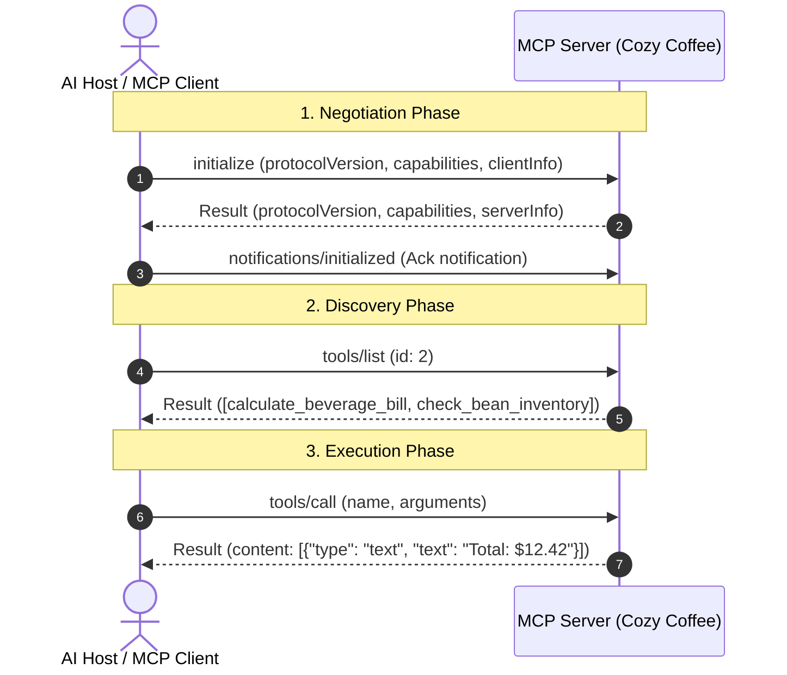

# Project 021: MCP Architecture: JSON-RPC 2.0 & Handshake Protocol

> **Stage**: Stage 1: Pure Fundamentals  
> **Difficulty**: 2.5 / 10 (Beginner Friendly)  
> **Primary Pillar**: `MCP`  
> **Auxiliary Disciplines**: Systems Interoperability & Network Protocols  

---

## 🎯 The Big Question: What is MCP and Why Does it Exist?

Before the **Model Context Protocol (MCP)**, connecting an AI model to an external database, code editor, or API required custom glue code for every combination of client (Claude, Cursor, LangChain, AutoGen) and server (Postgres, GitHub, Slack).

MCP is the open standard (pioneered by Anthropic) that acts as **"USB-C for Artificial Intelligence"**:
- **Clients** (AI Hosts like Claude Desktop, IDEs, or Custom Agents) implement an MCP Client.
- **Tools & Data** implement an MCP Server.
- Any client can seamlessly connect to any server using standardized **JSON-RPC 2.0** messages!

---

## 🧠 The Wire Protocol: JSON-RPC 2.0

Every message exchanged across standard I/O (stdio) or HTTP/SSE adheres to the JSON-RPC 2.0 specification:
```json
{
  "jsonrpc": "2.0",
  "id": 1,
  "method": "tools/call",
  "params": {
    "name": "calculate_beverage_bill",
    "arguments": {"drink": "latte", "quantity": 2, "oat_milk": true}
  }
}
```

---

## 🏗️ The 4-Step Handshake Lifecycle



---

## 📂 Project Structure

```text
021_only_mcp_jsonrpc_protocol_basics/
├── README.md              # Complete guide, quiz, and stretch challenge (this file)
├── requirements.txt       # Dependencies (mcp, etc.)
├── config.py              # LLM client & automatic fallback resolution
├── main.py                # Runnable spec-compliant MCP Coffee Server
└── test_verification.py   # Automated assertion tests
```

---

## 🚀 Execution & Verification

### 1. Run the Main Demonstration
```bash
python main.py
```
*Inspect the raw outgoing and incoming JSON-RPC 2.0 packets as the client negotiates capabilities, discovers tools, and invokes calculations.*

### 2. Run the Verification Tests
```bash
python test_verification.py
```

---

## 💡 Concept Self-Quiz (Test Your Understanding)

1. **Question**: What is the difference between an RPC Request and an RPC Notification in JSON-RPC 2.0?
   - **Answer**: An RPC Request contains an `"id"` field (e.g. `"id": 1`) and **requires** the server to respond with a matching `"id"` result or error. A Notification (such as `notifications/initialized`) intentionally omits the `"id"` field, signaling to the server that no response or acknowledgment should be sent.

2. **Question**: Why does `tools/list` return a JSON Schema for each tool's `inputSchema`?
   - **Answer**: The JSON Schema tells the LLM host exactly what parameters are expected, their data types (`string`, `integer`, `boolean`), allowable enum choices, and which fields are strictly required. The LLM uses this schema to generate structured tool-calling arguments.

3. **Question**: What are the two primary transport mechanisms supported by the MCP specification?
   - **Answer**: Standard Input/Output (`stdio`) for local process-to-process communication (ideal for desktop CLI tools and secure local subprocesses), and Server-Sent Events over HTTP (`SSE`) for remote network-based tools.

---

## 🛠️ Hands-on Stretch Challenge

Modify `main.py` to add a **Third Tool: `apply_discount_coupon`**:
- Define a tool schema that accepts `order_total` (float) and `coupon_code` (string).
- If the coupon code is `"COZY10"`, apply a 10% discount; if invalid, return a friendly error message.
- Add an example call in `main()` and test that JSON-RPC returns the discounted receipt!
