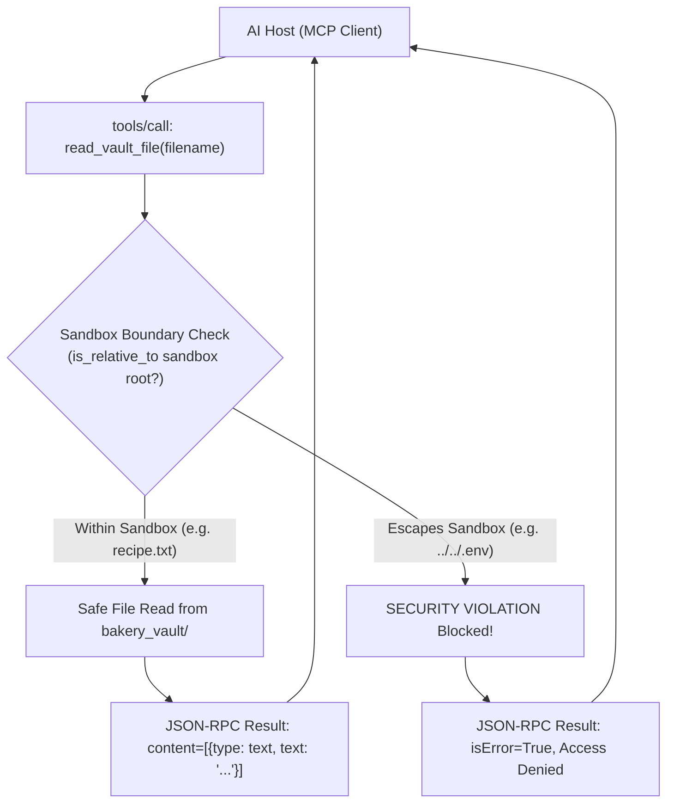

# Project 022: Custom Local Filesystem MCP Server

> **Stage**: Stage 1: Pure Fundamentals  
> **Difficulty**: 3.0 / 10 (Intermediate)  
> **Primary Pillar**: `MCP`  
> **Auxiliary Disciplines**: Security & Directory Sandboxing (CWE-22 Defense)  

---

## 🎯 The Big Problem: Directory Traversal Attacks in AI Agents

When building an MCP server that provides file access (`read_file`, `write_file`, `list_directory`), developers often make the mistake of trusting the agent's input arguments.
If an agent or attacker requests:
```text
read_file(filename="../../../../etc/passwd")
read_file(filename="../../.env")
```
A naive server reads and returns sensitive server secrets! This vulnerability is known as **Path Traversal (CWE-22)**.

---

## 🧠 The Sandbox Defense Architecture

A secure Filesystem MCP Server enforces two non-negotiable security layers:
1. **Absolute Path Denial**:
   - Any path that starts with `/`, `\`, or contains a Windows drive letter (`C:`) is immediately rejected before touching the filesystem.
2. **Canonical Sandbox Boundary Verification (`Path.relative_to`)**:
   - The candidate path is resolved to its canonical absolute form: `(vault_dir / rel_path).resolve()`.
   - Python's `candidate.relative_to(vault_dir)` is checked. If the path escapes the sandbox root, a `PermissionError` is raised and caught, returning `isError: true` to the MCP client.

---

## 🏗️ Architecture & Control Flow



---

## 📂 Project Structure

```text
022_only_mcp_local_filesystem_server/
├── README.md              # Complete guide, quiz, and stretch challenge (this file)
├── requirements.txt       # Dependencies
├── config.py              # LLM client & automatic fallback resolution
├── bakery_vault/          # Sandboxed root directory (recipes & menus)
├── main.py                # Runnable Secure Filesystem MCP Server
└── test_verification.py   # Automated assertion tests (including attack simulations)
```

---

## 🚀 Execution & Verification

### 1. Run the Main Demonstration
```bash
python main.py
```
*Observe the server listing recipes, reading bun recipes, saving a new scone recipe, and successfully intercepting a malicious `../../.env` traversal attempt.*

### 2. Run the Verification Tests
```bash
python test_verification.py
```

---

## 💡 Concept Self-Quiz (Test Your Understanding)

1. **Question**: Why is checking `if ".." in path` insufficient to stop path traversal attacks?
   - **Answer**: Attackers can bypass naive string checks using URL encoding (`%2e%2e%2f`), double slashes, unicode normalization tricks, symlinks, or absolute paths (`/etc/shadow`). Canonical resolution (`Path.resolve()`) followed by checking `.relative_to(sandbox_root)` is the only mathematically proven defense.

2. **Question**: Does an MCP tool error crash the MCP server process?
   - **Answer**: No! In the MCP specification, if a tool fails (e.g., file not found or security denial), the server catches the exception and returns `{"result": {"isError": true, "content": [{"type": "text", "text": "Error message"}]}}`. The JSON-RPC connection remains alive and healthy.

3. **Question**: What is the difference between an MCP Tool and an MCP Resource?
   - **Answer**: An MCP **Tool** represents an active, executable function with side effects (like saving a file or calling an API) invoked via `tools/call`. An MCP **Resource** represents passive, readable data (like a file URI or database table) retrieved via `resources/read`.

---

## 🛠️ Hands-on Stretch Challenge

Modify `main.py` to add **File Size & Extension Whitelisting**:
- Enforce a maximum file size limit (e.g. reject writing any file larger than 100 KB).
- Restrict write operations exclusively to `.txt` and `.md` file extensions, blocking attempts to write executable scripts like `.py`, `.sh`, or `.exe`.
- Test saving `test.py` and verify that the security guardrail rejects the disallowed extension!
