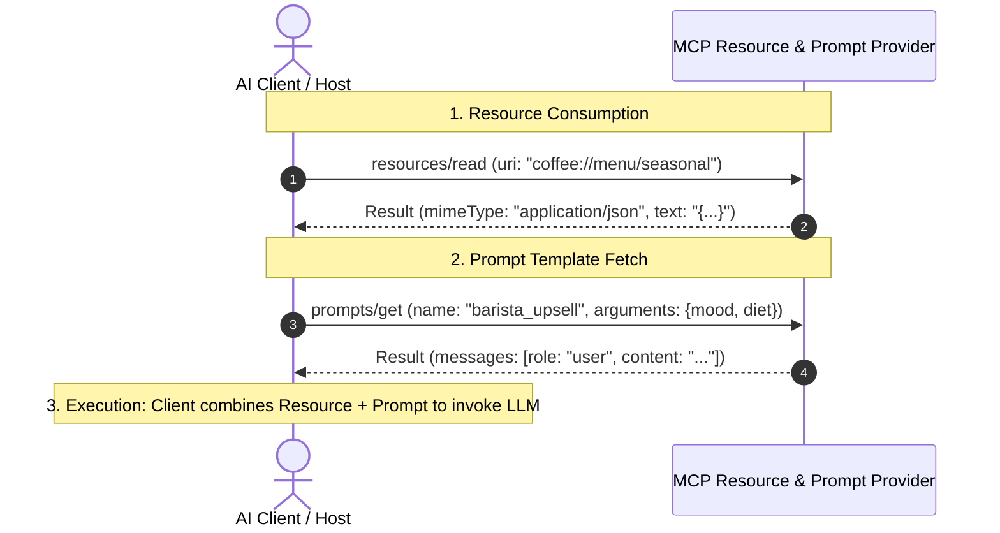

# Project 024: Dynamic Resources & Reusable Prompt Templates via MCP

> **Stage**: Stage 1: Pure Fundamentals  
> **Difficulty**: 3.5 / 10 (Intermediate)  
> **Primary Pillar**: `MCP`  
> **Auxiliary Disciplines**: Context Engineering & Dynamic Prompting  

---

## 🎯 The Big Question: Beyond Tools, What Else Does MCP Provide?

Many developers assume the Model Context Protocol (MCP) is only for tool calling.
In reality, MCP is built on **three foundational pillars**:

| MCP Primitive | Protocol Method | Purpose | Side Effects? |
| :--- | :--- | :--- | :--- |
| **Tools** | `tools/call` | Executable operations (write file, run SQL, send SMS). | Yes (Active) |
| **Resources** | `resources/read` | Passive, readable data streams identified by URIs (`coffee://menu/seasonal`, `file:///logs.txt`). | No (Read-Only) |
| **Prompts** | `prompts/get` | Parameterized, domain-expert prompt templates maintained server-side. | No (Template) |

---

## 🧠 Why Server-Side Resources and Prompts Matter

1. **Resources (`resources/read`)**:
   - Provide direct contextual ground-truth to the AI without wasting a tool-calling turn.
   - Support arbitrary MIME types: `application/json`, `text/plain`, `text/markdown`.
2. **Prompts (`prompts/get`)**:
   - Centralize prompt engineering on the server where domain experts work.
   - When domain rules or product personas evolve, updating the MCP server automatically updates every client application without client code redeployment.

---

## 🏗️ Architecture & Control Flow



---

## 📂 Project Structure

```text
024_only_mcp_resource_prompt_provider/
├── README.md              # Complete guide, quiz, and stretch challenge (this file)
├── requirements.txt       # Dependencies
├── config.py              # LLM client & automatic fallback resolution
├── main.py                # Runnable MCP Resource and Prompt Provider
└── test_verification.py   # Automated assertion tests
```

---

## 🚀 Execution & Verification

### 1. Run the Main Demonstration
```bash
python main.py
```
*Observe the discovery of custom `coffee://` URI resources, reading seasonal menu JSON data, rendering a customized barista upsell prompt template, and generating a live personalized recommendation with Groq LLM.*

### 2. Run the Verification Tests
```bash
python test_verification.py
```

---

## 💡 Concept Self-Quiz (Test Your Understanding)

1. **Question**: When should an application use an MCP Resource instead of an MCP Tool?
   - **Answer**: Use an MCP Resource when the data is read-only, persistent, or structural context that does not require taking an action or computing dynamic arguments (e.g. current system configuration, documentation, active menu). Use an MCP Tool when the model needs to take an active step, pass computation parameters, or mutate external state.

2. **Question**: What are Resource URI schemes in MCP?
   - **Answer**: MCP resources use standard URIs to identify data streams (e.g. `postgres://db/schema`, `file:///workspace/readme.md`, `coffee://menu/seasonal`). Servers can define custom application schemes to partition and namespace their data logically.

3. **Question**: Can an MCP Prompt return multiple message turns?
   - **Answer**: Yes! The `prompts/get` response returns an array of `messages`, which can include few-shot demonstrations with alternating `user` and `assistant` message roles.

---

## 🛠️ Hands-on Stretch Challenge

Modify `main.py` to add **Dynamic Resource Subscriptions**:
- Add a resource `coffee://live/orders-in-queue` that updates each time a drink is purchased.
- Implement an MCP notification `notifications/resources/updated` to notify connected clients whenever the queue count changes!
