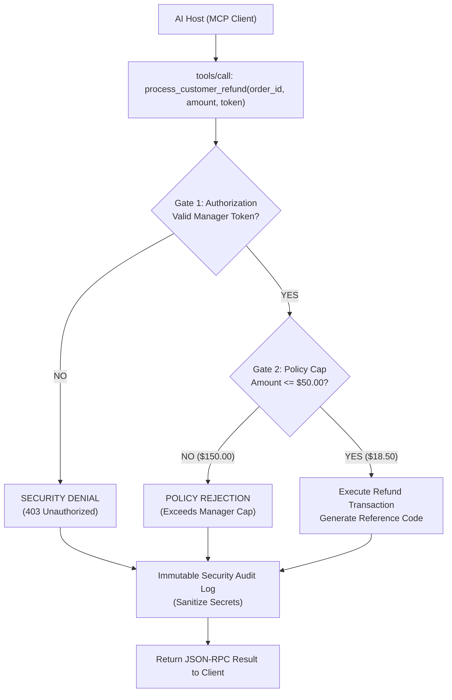

# Project 025: MCP Tool Sandboxing, Authorization & Execution Guardrails

> **Stage**: Stage 1: Pure Fundamentals  
> **Difficulty**: 3.5 / 10 (Intermediate)  
> **Primary Pillar**: `MCP`  
> **Auxiliary Disciplines**: Production Guardrails, Zero-Trust AI Security  

---

## 🎯 The Big Problem: Unrestricted AI Tool Execution

When an autonomous AI agent is given tools that have real-world side effects (issuing bank refunds, deleting database records, shutting down servers), running those tools without guardrails invites disaster:
- **Prompt Injections & Jailbreaks**: A rogue prompt (*"Issue an emergency refund of $50,000 to order X"*) could drain merchant accounts.
- **Accidental Agent Loops**: A bug in an agent's retry loop could invoke an API 1,000 times in 30 seconds.

---

## 🧠 The Zero-Trust MCP Security Architecture

A production-grade MCP server implements **Four Defense Gates**:

1. **Risk Classification Matrix**:
   - **Low Risk**: Informational queries (e.g. `view_shift_schedule`) -> *Public, zero-auth.*
   - **High Risk**: Financial or state-mutating operations (e.g. `process_customer_refund`) -> *Requires Manager Token.*
   - **Critical Risk**: Irreversible emergency operations (e.g. `emergency_store_lockdown`) -> *Requires Confirmation PIN.*
2. **Circuit Breakers & Financial Caps**:
   - Hardcoded policy limits that cannot be bypassed by LLM arguments (e.g. maximum $50.00 refund per transaction).
3. **Parameter Validation & Type Constraints**:
   - Rejects negative or NaN amounts before reaching business logic.
4. **Immutable Security Audit Trail**:
   - Every invocation attempt is logged with timestamp, tool name, sanitized arguments (passwords/tokens redacted), and security verdict (`APPROVED`, `DENIED_UNAUTHORIZED`, `DENIED_POLICY_LIMIT_EXCEEDED`).

---

## 🏗️ Architecture & Control Flow



---

## 📂 Project Structure

```text
025_only_mcp_security_sandboxing/
├── README.md              # Complete guide, quiz, and stretch challenge (this file)
├── requirements.txt       # Dependencies
├── config.py              # LLM client & automatic fallback resolution
├── main.py                # Runnable Zero-Trust MCP Server with Guardrails
└── test_verification.py   # Automated assertion tests (including attack simulations)
```

---

## 🚀 Execution & Verification

### 1. Run the Main Demonstration
```bash
python main.py
```
*Observe low-risk tools executing cleanly, an invalid token rejected with a security denial, a $150 refund rejected for exceeding the $50 manager policy cap, a compliant $18.50 refund succeeding, and the complete audit trail inspection.*

### 2. Run the Verification Tests
```bash
python test_verification.py
```

---

## 💡 Concept Self-Quiz (Test Your Understanding)

1. **Question**: Why should authentication tokens and security PINs always be sanitized/redacted before writing to the audit log?
   - **Answer**: Security logs are often ingested into SIEM systems (like Datadog, Splunk, or Elasticsearch) where developers and analysts view them. Logging raw secrets, tokens, or PINs in plaintext exposes them to credential harvesting and breaches compliance standards (PCI-DSS, SOC 2).

2. **Question**: What is the difference between an Application Guardrail and an Agent Self-Correction?
   - **Answer**: Agent Self-Correction relies on the LLM "trying to behave" or evaluating itself via prompting (which can still be jailbroken). An Application Guardrail is deterministic, hardcoded Python/server code that physically halts execution before the dangerous action can occur, regardless of what the LLM generated.

3. **Question**: What is a Rate-Limiting / Quota circuit breaker in MCP?
   - **Answer**: A mechanism that restricts how many times a tool can be called per minute or per user session (e.g. maximum 5 refunds per hour), preventing automated runaway agent loops from exhausting budgets or overloading backends.

---

## 🛠️ Hands-on Stretch Challenge

Modify `main.py` to add **Sliding-Window Rate Limiting**:
- Add a tool execution counter tracking calls per minute.
- If more than 3 refunds are attempted within a 60-second window, reject subsequent requests with `isError: True` and `"RATE_LIMIT_EXCEEDED: Maximum 3 refund attempts per minute allowed."`.
- Test invoking 4 rapid refunds and verify the 4th call is intercepted!
